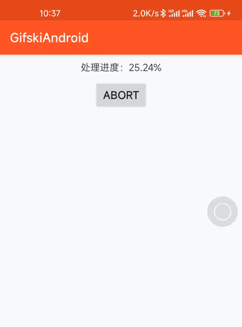

# GifskiAndroid

[gifski](https://github.com/ImageOptim/gifski) in Android

# 关于运行本项目（About run this project）

```shell
$ cd PROJECT_DIRECTORY/sampleres
$ ffmpeg -i video_1605594658258.mp4 frame%04d.png
$ mkdir 3479
$ mv frame*.png 3479/
$ cd ..
$ adb install app-release.apk
$ adb push sampleres/3479 /storage/emulated/0/Android/data/com.lingyx.gifgski/files/3479/
$ adb shell monkey -p com.lingyx.gifgski -c android.intent.category.LAUNCHER 1
```



# gifski Rust run in Android 渡劫历程（How to compile gifski source code as Androud static library）

arm64-v8a 编译命令：
```shell
$ cargo build --target aarch64-linux-android --release
```

running: "aarch64-linux-android-clang" "-O3" "-DANDROID" "-ffunction-sections" "-fdata-sections" "-fPIC" "-I" "vendor/include" "-I" "vendor/src" "-I" "/home/lingyunxiao/dev/gifski/target/aarch64-linux-android/release/build/gifsicle-760473700236e26d/out" "-DHAVE_CONFIG_H=1" "-DSIZEOF_VOID_P=8" "-DSIZEOF_UNSIGNED_LONG=8" "-DVERSION=\"1.92.5\"" "-Dmain=gifsicle_main" "-o" "/home/lingyunxiao/dev/gifski/target/aarch64-linux-android/release/build/gifsicle-760473700236e26d/out/vendor/src/clp.o" "-c" "vendor/src/clp.c"

--- stderr

error occurred: Failed to find tool. Is `aarch64-linux-android-clang` installed?

此前频繁遇到这个错误，无法确定是去哪里找 aarch64-linux-android-clang，在 toml 文件里配置了路径但无效，后灵机一动将路径配置到环境变量中（参见下面的描述）即解决。

编译后遇到很多下面的错误：

error: undefined reference to 'stderr'

下面的信息提醒了可能是 api level 版本不匹配

https://github.com/curl/curl/issues/3247

Problem solved. I was using api=26 for building CURL, but api=19 for building the app.

于是在这个教程里的配置交叉编译再次尝试：
https://cloud.tencent.com/developer/article/1442043
```shell
lingyunxiao ~/dev/android-sdk/ndk/NDK $ ${NDK_HOME}/build/tools/make_standalone_toolchain.py --api 21 --arch arm64 --install-dir arm64
lingyunxiao ~/dev/android-sdk/ndk/NDK $ ${NDK_HOME}/build/tools/make_standalone_toolchain.py --api 21 --arch arm --install-dir arm
lingyunxiao ~/dev/android-sdk/ndk/NDK $ ${NDK_HOME}/build/tools/make_standalone_toolchain.py --api 21 --arch x86 --install-dir x86
```

将环境变量里的 NDK_HOME 改为 android 工程使用的那个 ndk，重新生成交叉编译环境

注意 api level，最好不高于 min sdk version，否则可能会在打包静态库时编译错误（未验证）

.bashrc 里的配置：
```
PATH=...:$HOME/dev/android-sdk/ndk/NDK/arm64/bin/
export ANDROID_HOME=/home/lingyunxiao/dev/android-sdk
export NDK_HOME=$ANDROID_HOME/ndk/21.1.6352462  这个路径与工程使用的对应
```

Cargo.toml 里的配置（同步到 ~/.cargo/config，不确定这一步是否有用，可以在出问题时再尝试做配置）
```
[target.aarch64-linux-android]
ar = "/home/lingyunxiao/dev/android-sdk/ndk/NDK/arm64/bin/aarch64-linux-android-ar"
linker = "/home/lingyunxiao/dev/android-sdk/ndk/NDK/arm64/bin/aarch64-linux-android-clang"
[target.armv7-linux-androideabi]
ar = "/home/lingyunxiao/dev/android-sdk/ndk/NDK/arm/bin/arm-linux-androideabi-ar"
linker = "/home/lingyunxiao/dev/android-sdk/ndk/NDK/arm/bin/arm-linux-androideabi-clang"
[target.i686-linux-android]
ar = "/home/lingyunxiao/dev/android-sdk/ndk/NDK/x86/bin/i686-linux-android-ar"
linker = "/home/lingyunxiao/dev/android-sdk/ndk/NDK/x86/bin/i686-linux-android-clang"
```

编出包后如何调用：

取 target/aarch64-linux-android（v7a不是这个路径）/release/libgifski.a 静态库，放在 gifski/src/main/cpp/arm64-v8a/libgifski.a

取 https://raw.githubusercontent.com/ImageOptim/gifski/main/gifski.h 放在 gifski/src/main/cpp/include/GifskiApi.h，不需要改动

在 Android.mk 文件里添加打包这个静态库的逻辑：

```
include $(CLEAR_VARS)
LOCAL_MODULE:=gifski
LOCAL_SRC_FILES:= $(TARGET_ARCH_ABI)/libgifski.a   注意路径
include $(PREBUILT_STATIC_LIBRARY)
编好后可尝试解压 apk 并在 so 目录里搜索以确认有打包进去，可搜索某个方法名，如 "srtext gifski_add_frame_png_file" 如果搜索到说明打包成功
```
然后就是 cpp 里调用方法了：
```cpp
#include <include/GifskiApi.h>
JNIEXPORT jlong JNICALL
JNI_FUNC(gifskiNew)(JNIEnv *env, jclass type, jint width) {
    GifskiSettings *set = new GifskiSettings();
    LOGI("new func width:%d", width);
    set->width = width;
    set->height = width;
    set->quality = 90;
    set->fast = false;
    set->repeat = false;
    gifski *dfa = gifski_new(set);
    if (dfa == nullptr) {
    LOGI("gifski obj is null");
    } else {
    // 打印这个日志说明调用成功
    LOGI("gifski obj valid");
    }
    return 3333;
}
```

# 关于效率及体积相关的测算
```
android opengl 抽帧 vs ffmpeg 抽帧 对比（png 格式）：
帧数：相同
帧质量：目测无差异
帧大小：489kb vs 421kb android opengl 略大，但可接受

BurstLinker(png) vs gifski 生成 gif 对比：
耗时：353982ms vs 569356ms，BurstLinker 更快
同样尺寸，输出 gif 文件大小：81MB vs 43M(desktop) 30M(android) gifski 完胜
输出 gif 文件质量：目测 gifski 略好，但差异不明显，某些帧 BurstLinker 有明显跳动但 gifski 没有

BurstLinker jpg vs png 格式：
耗时：350003ms vs 353982ms，jpg 更快
同样尺寸，输出 gif 文件大小：98MB vs 81M png 更小
输出 gif 文件质量：无差异
```

```
03-01 16:01:38.570  7750 20694 I MorphJni: gifski obj valid----
03-01 16:11:01.010  7750 20694 I MorphJni: loop finish:0
(9*60+29)*1000+356=569356
```

```
$ ffmpeg -i demo.mp4 frame%04d.png
$ gifski -o anim.gif -W 400 -H 867 frame*.png

$ du -sh output.gif
$ adb pull /storage/emulated/0/Android/data/com.lingyunxiao.gifski/files/output.gif

$ cargo build --target aarch64-linux-android --release
$ cp target/aarch64-linux-android/release/libgifski.a ~/dev/GifskiAndroid/gifski/src/main/cpp/arm64-v8a/

$ cargo build --target armv7-linux-androideabi --release
$ cp target/armv7-linux-androideabi/release/libgifski.a ~/dev/GifskiAndroid/gifski/src/main/cpp/armeabi-v7a/

$ adb push ~/Desktop/vigif/4234_png /storage/emulated/0/Android/data/com.lingyx.gifgski/files/
```

```
gifski v8a so 对比，release 包：
带 jni + android log 的体积：3.6M，压缩打包到 apk 后：1.4MB
只带 android log 的体积：3.3M，压缩打包到 apk 后：1.3MB
只带 jni 的体积：2.7M，压缩打包到 apk 后：1MB
都不带：2.4M，压缩打包到 apk 后：992KB
```

# gifski 的体验结论：

对 cpu 优化有问题，又或者是 rust 编译对 cpu 的适配问题，在 android 运行时会失真，但使用 ubuntu 执行 gifski 命令并没有。

另外，编码太耗时，而且要求 png 格式，png 格式虽理想，但文件体积太大，不适用于移动端对视频抽帧这种动不动就好几百帧的场景。

以上问题尝试在源码找解决方案，但未能成功，发邮件给作者未获回复。

# license

```
only a demo, no license, free to use
```
